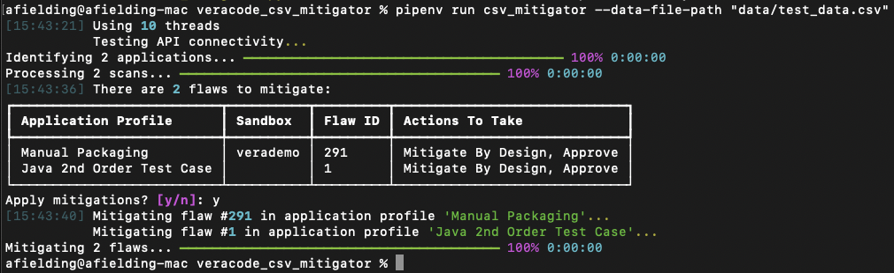

# Veracode SAST Bulk CSV Mitigator

**Note this tool is not an official Veracode product. It comes with no support or warranty.**

## Introduction

This tool performs bulk mitigation actions on Veracode SAST flaws based off a CSV file.

There are two primary uses cases this tool solves:
1. Bulk mitigating flaws - useful for development teams/security champions
2. Bulk accepting mitigated flaws - useful for security teams

### 1. Bulk Mitigating Flaws

Development teams or security mentors could use this tool to propose mitigations (e.g. Mitigate By Design, False Positive) for flaws that are reported one or more application profiles.

### 2. Bulk Accepting Mitigated Flaws

The tool can be used by security teams for bulk-approving or rejecting mitigations that have been reviewed in more than one application profile.

## Key Features ✅

* Uses the standard [Veracode API credentials file](https://docs.veracode.com/r/c_configure_api_cred_file)
* Shows a summary before any action is carried out
* Can propose and/or approve/reject mitigations in bulk
* Multithreaded for speed

## What To Mitigate

For targeted mitigation, the tool will check for all 3 matching signatures when considering each flaw the applications specified:

1. Application Name
2. CWE
3. Flaw ID

It is recommended when testing a new mitigation signature to only use a single application profile name in this text file. Once the tool has been verified to work as expected the file can be updated to include more profile names, or alternatively specify `--all-application-profiles=true` to apply mitigations across all the application profiles.

The tool will not take any mitigation action until the user explicitly enters "y" to apply the mitigations once a summary of what will be mitigated has been presented.

## Multiple Mitigation Actions

The tool can be used to apply a single action or multiple mitigation actions per flaw, for example a "Mitigate By Design" or a "False Positive" followed by an "Approve" action. The tool will make sure they are applied in a logical order. It is not allowed to specify both "Mitigate By Design" and "False Positive" because that does not make sense as only one of those statements can be true.

It is also possible to propose an "Accept the Risk" action prior to "Approve" if that is how your organisation operates.

## Example



## Authenticating With The Veracode APIs

This tool makes use of the Veracode APIs ([listed below](#outbound-api-calls)). You will need Veracode API credentials
and the [Reviewer or Security Lead role](https://docs.veracode.com/r/c_API_roles_details#results-api) for this tool to
work. We recommend you configure
a [Veracode API credentials file](https://docs.veracode.com/r/c_configure_api_cred_file).

## Installation 📦

Follow these steps to install the tool:

1. Ensure you have [Python 3](https://www.python.org/downloads/) installed.
2. Install [Pipenv](https://pipenv.pypa.io/) typically via your package manager or by running `pip install --user --upgrade pipenv`
3. Clone this repository `git clone https://github.com/antfie/veracode_csv_mitigator/tree/main`
4. Ensure you have a [Veracode API credentials file](https://docs.veracode.com/r/c_api_credentials3) configured.

## Running

1. Ensure you have configured the CSV column definitions `data/csv_field_mappings.csv`.
2. Make sure you have a CSV file with the mitigations.  
3. Run the below command to run the tool. Note that the tool will not make any changes unless you enter "y" at the prompt following the summary of mitigations to add.

    ```bash
    pipenv run csv_mitigator --data-file-path "path_to_your_csv_file.csv"
    ```

## Troubleshooting

If you experience issues running pipenv see this [guide](https://pipenv.pypa.io/en/latest/installation.html). On Windows you may need to update your path environment variable. Alternatively try running pipenv via python like so:

```bash
python3 -m pipenv run csv_mitigator
```

Finally, as a last resort consider using pip to install the dependencies:

```bash
python3 -m pip install --user -r requirements.txt
python3 csv_mitigator.py
```

## Development

When repeatedly running the tool it helps to cache some of the requests to speed things up. Use this flag to do that:

```bash
pipenv run csv_mitigator --application-cache-file-path "data/cache.csv"
```

Note that if an application or sandbox is renamed/added/deleted then the cache may have stale data, so it is recommended to clear the cache file regularly.

## Development

There is a script to lint the code, keep dependencies up to date and run some tests:

```bash
pipenv run test
```
